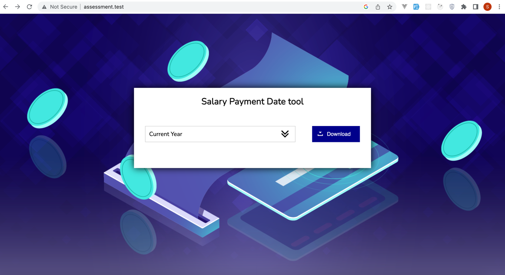
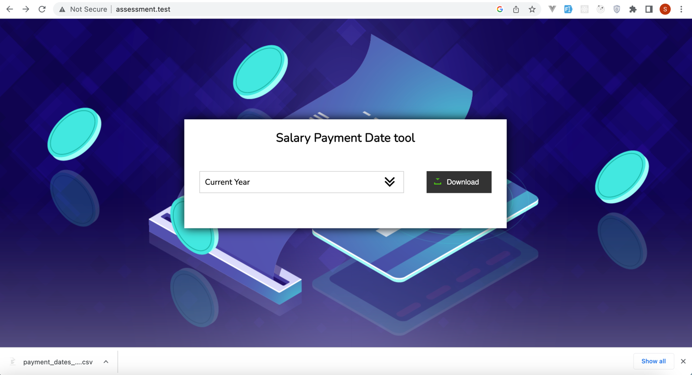

# Salary Payment Date tool Assignment
This is a tool to calculate the salary payment date for a given month. The tool is written in PHP and uses the Laravel framework.

## Overview

Task details can be accessed [here](https://github.com/bas-world/developer-challenge-pay-dates).

## Technologies used
- Server application:
    - [PHP's Laravel](https://laravel.com/), A PHP web framework with focus on speed of development and perfectionism.

## Why Laravel?
The reason I choose Laravel is to utilize its speed of development and the built-in of Commands that enables 
execution of the code from the command line using the `php artisan salary:payment-dates` command.

## Installation
### Local installation
Running this tool locally requires you to download and install php and composer.
- Installation with composer:
    - Run `composer install` to install the dependencies.
    - Create a `.env` file using the [.env.example](/.env.example) file as a template. All the appropriate values has been filled in the `.env.example`, this will enable you to run the application locally without issues.
    - Run `php artisan key:generate` to generate the application key.

## Usage
- Command Line
  - By executing the command `php artisan salary:payment-dates` from the root directory of the project, a csv file will be 
  generated in the root directory of the project with the name `salary_payment_dates_{prefix of the current or selected Year}.csv`.
    - Run `php artisan salary:payment-dates` to execute the code using the command line.

- Web
  - By running the command `php artisan serve` from the root directory of the project, the application will be available at 
  `http://127.0.0.1:8000/` by default.
  - Access the application from the browser using the generated url `http://127.0.0.1:8000/`
  - Select the year or leave it as the current year and click on the `Download CSV` button to generate the csv file. 
    The csv file will be downloaded automatically to your machine.

  
## Files used in the project
Given that laravel ships with a lot of files, I will only list the files that are relevant to the project.
- `app/Console/Commands/GenerateSalaryPaymentCommand.php` - This is the command that is used to generate the csv file via the command line.
- `app/Services/SalaryPaymentService.php` - This is the service class that contains the logic for generating the salary payment dates and generating the csv file.
- `app/routes/api.php` - This is the file that contains the route logic for the web request to generate the csv file.
- `app/resources/views/welcome.blade.php` - This is the view file that contains the html for the web user interface.
- `app/tests/Feature/SalaryPaymentServiceTest.php` - This is the test file that contains the test cases for the application.
The listed files are the only files that are relevant to the project.

    
## Testing 🚨
- Automated testing
    - Run `php artisan test` to execute the test cases.
  

## Discussion
* These decisions were made to make the tool more efficient and to make it easier to maintain.

### Improvements for a production API
- Write tests with attention to cover more edge cases.
